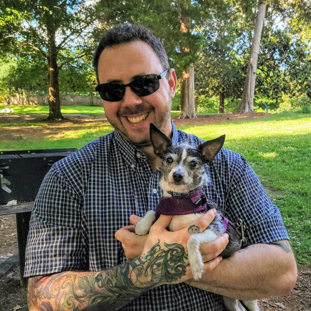

## Welcome to my home page.

I'm a software engineer and dog rescuer in Cary, North Carolina :)

I build software at [Red Hat](https://www.redhat.com/). I'm currently working on [Red Hat OpenShift](https://www.openshift.com/).

My wife Candace and I also run a small senior dog rescue, and we usually have 5 to 10 little rescue dogs in our home! Please visit and like our Facebook page, [Simba's Seniors Dog Sanctuary](https://www.facebook.com/simbasseniors).

### Links

Pictures of dogs: [Facebook](https://www.facebook.com/gsheremeta) 
More pictures of dogs: [Simba's Seniors Dog Sanctuary](https://www.facebook.com/simbasseniors) 
My online resume: [Linked In](http://www.linkedin.com/in/gsheremeta) 
I don't tweet, ever: [Twitter](http://www.twitter.com/gregsheremeta) 
I try to avoid writing code: [Github](https://github.com/gregsheremeta)

Thanks for visiting :)

