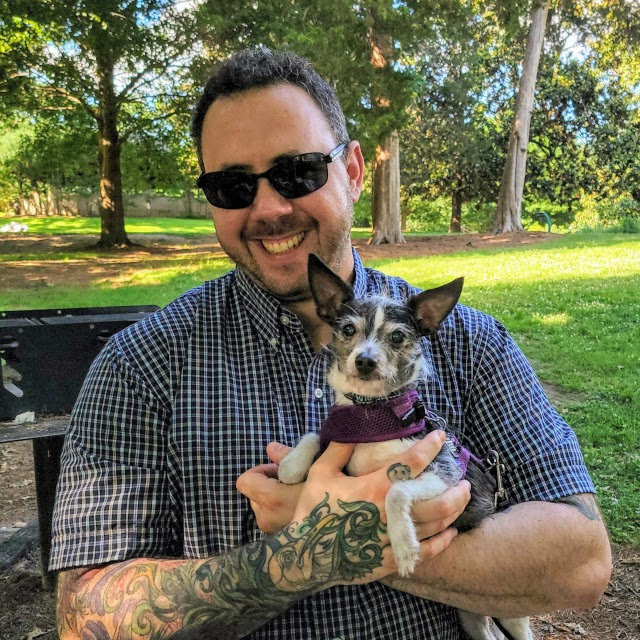

## Welcome to my home page.

I'm a crazy dog person and software engineer in Cary, North Carolina :)

I build software at [Red Hat](https://www.redhat.com/). I'm currently working on our AI/ML offering, [Red Hat OpenShift AI](https://www.redhat.com/en/technologies/cloud-computing/openshift/openshift-ai).

I enjoy volunteering for [Chihuahua Rescue and Transport](https://www.chihuahua-rescue.com/southeast/).

My online resume: [Linked In](http://www.linkedin.com/in/gsheremeta) 

Thanks for visiting :)

